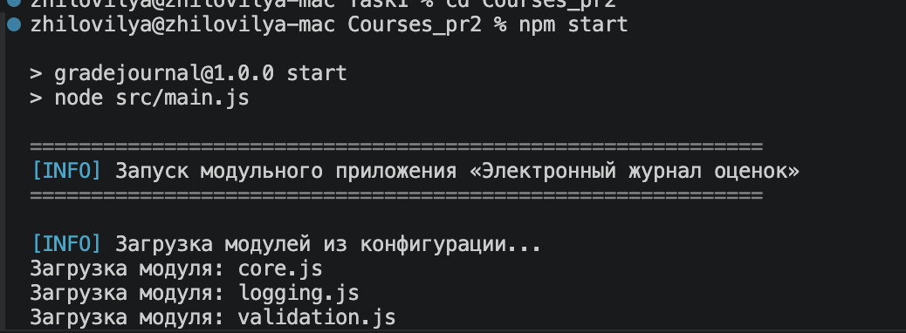
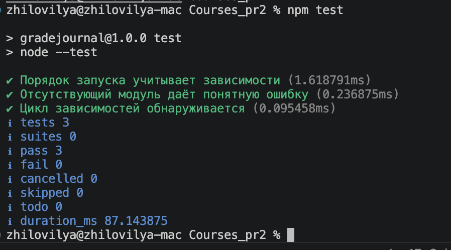
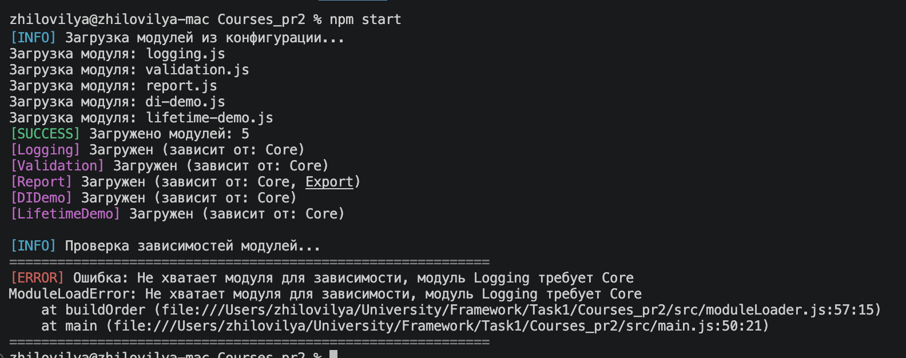
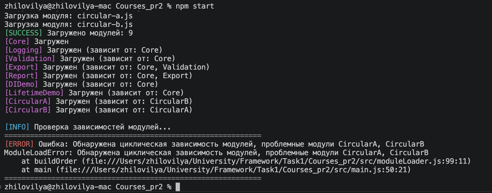

# Практическое занятие №2

https://github.com/zhilovhub/UniveristyFrameworks/tree/master/Courses_pr2

## Электронный журнал оценок студентов

Разработанное приложение представляет собой модульный фреймворк на Node.js, который позволяет загружать и выполнять модули расширения с автоматическим управлением их зависимостями. Предметная область — электронный журнал оценок студентов: модули принимают записи об успеваемости, проверяют их корректность, сохраняют в общем хранилище, экспортируют в файл и формируют сводный отчёт.

При запуске приложение читает конфигурационный файл `config/modules.json`, загружает указанные в нём модули из папки `modules`, проверяет корректность их зависимостей, определяет порядок запуска и последовательно выполняет все зарегистрированные модулями действия. В результате работы создаётся файл `grades.txt` с данными об оценках и выводится информация о выполненных операциях.

Фреймворк построен на принципе инверсии управления: ядро управляет жизненным циклом модулей, а модули только реализуют заданный контракт. Это позволяет добавлять новые модули без изменения кода ядра.

## Состав ядра

Ядро состоит из следующих компонентов:

- `container.js` — контейнер внедрения зависимостей. Поддерживает два типа времени жизни объектов: Singleton (один экземпляр на всё приложение) и Transient (новый экземпляр при каждом запросе). Позволяет регистрировать сервисы и получать их по ключу.
- `moduleLoader.js` — загрузчик модулей. Выполняет динамическую загрузку модулей из папки `modules`, проверяет наличие всех зависимостей, строит порядок запуска с помощью топологической сортировки, обнаруживает циклические зависимости и проверяет совместимость версий контракта.
- `main.js` — точка входа. Оркестрирует весь процесс: загружает модули, определяет порядок запуска, вызывает регистрацию сервисов, инициализацию модулей и выполняет зарегистрированные действия.
- `errors.js` — определяет класс `ModuleLoadError` для ошибок, связанных с загрузкой модулей.
- `logger.js` — утилита для цветного логирования в консоль.

## Состав модулей

Все модули следуют единому контракту: каждый экспортирует объект с полями `name`, `version`, `contractVersion`, `requires` и методами `register()` и `init()`. Реализовано 7 модулей:

- `core.js` — базовый модуль. Регистрирует сервисы `clock` (время) и `storage` (хранилище записей об оценках). Не имеет зависимостей.
- `logging.js` — модуль журналирования. Регистрирует действие, которое фиксирует факт открытия журнала с отметкой времени. Зависит от Core.
- `validation.js` — модуль проверки оценок. Регистрирует действие, которое валидирует тестовый набор записей (имя студента, предмет, оценка от 2 до 5) и добавляет их в хранилище. Зависит от Core.
- `export.js` — модуль экспорта. Регистрирует действие, которое сохраняет данные из хранилища в файл `grades.txt`. Зависит от Core и Validation.
- `report.js` — модуль сводки. Регистрирует действие, которое выводит количество записей и средний балл. Зависит от Core и Export.
- `di-demo.js` — демонстрационный модуль. Показывает, как зависимости внедряются через конструктор с помощью контейнера DI. Зависит от Core.
- `lifetime-demo.js` — демонстрационный модуль. Показывает разницу между Singleton и Transient. Зависит от Core.

## Демонстрация работы приложения

Запуск приложения командой `npm start` приводит к загрузке всех указанных в конфигурации модулей, построению корректного порядка запуска с учётом зависимостей и последовательному выполнению зарегистрированных действий. На скриншоте видно, что модули загружаются, регистрируют свои сервисы, инициализируются, после чего выполняются действия журналирования, валидации, демонстрации DI, времён жизни, экспорта и формирования сводки. В завершение проверяется наличие файла `grades.txt`.

```bash
npm start
```


## Проверка испытаниями

Реализованы три теста для проверки работы загрузчика модулей: корректный порядок запуска при разных наборах зависимостей, понятная ошибка при отсутствии нужного модуля и обнаружение циклической зависимости. Тесты запускаются стандартным средством Node.js без сторонних библиотек.

```bash
npm test
```



## Сценарий отсутствующего модуля

Чтобы убедиться, что приложение корректно реагирует на отсутствие необходимого модуля, в `config/modules.json` достаточно оставить только зависимый модуль и убрать тот, от которого он зависит. Например, оставить `report.js` без `core.js` и `export.js`. Приложение завершит работу с понятным сообщением о том, какого именно модуля не хватает.



## Сценарий циклических зависимостей

Для проверки сценария циклических зависимостей в репозитории есть пара модулей `circular-a.js` и `circular-b.js`, которые ссылаются друг на друга. Если добавить их обоих в `config/modules.json`, приложение остановится и сообщит, какие модули образовали цикл.



## Расширение приложения

При добавлении нового модуля достаточно:

1. Создать файл в папке `modules`.
2. Реализовать контракт (поля `name`, `requires`, методы `register`, `init`).
3. Добавить имя файла в `config/modules.json`.

Ядро автоматически:

- Загрузит модуль через динамический импорт.
- Проверит его зависимости.
- Включит его в порядок запуска.
- Предоставит контейнер DI для регистрации сервисов.
- Выполнит его действие.

Ни одна строка кода в папке `src` не требует изменений.

## Запуск

```bash
npm install
npm start
npm test
```
