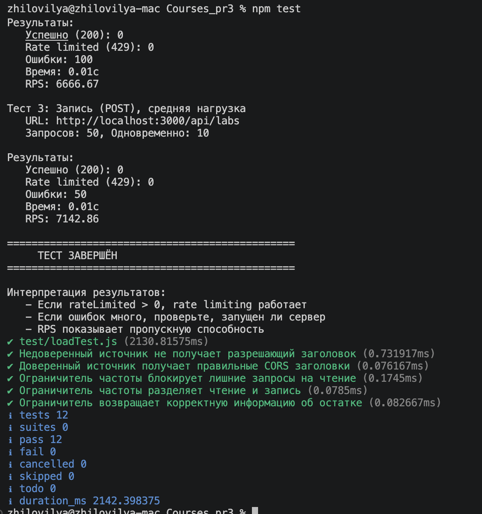
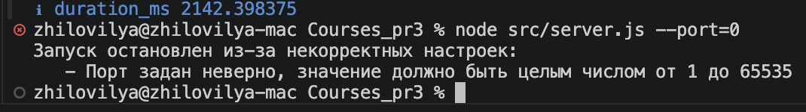
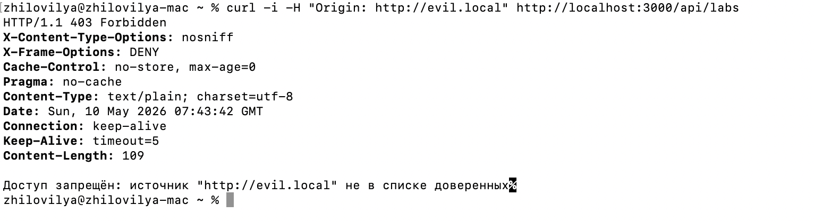
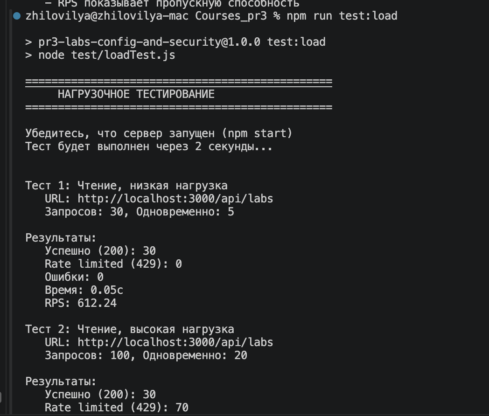
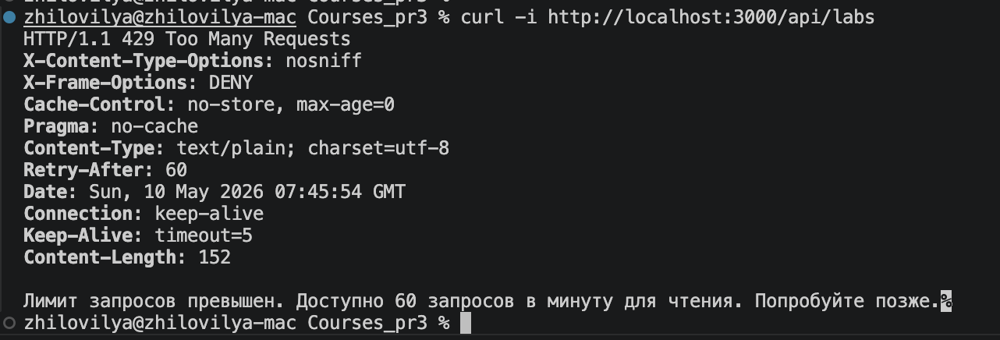

# Практическое занятие №3

## 1. Цель работы

Навести порядок в настройках веб-приложения и добавить базовую защиту, чтобы служба не была открыта всему миру на равных правах. Ключевой навык — ранняя проверка настроек и понятные причины отказа, когда параметры заданы неверно.

В качестве предметной области выбран учёт лабораторных работ студентов: каждая лабораторная имеет название (`title`) и максимальный балл (`maxScore`).

## 2. Постановка задачи

1. Реализовать чтение настроек из трёх источников с явным порядком приоритета.
2. Реализовать раннюю проверку корректности настроек и запретить запуск при ошибках.
3. Реализовать ограничение запросов из браузера только от доверенных источников.
4. Реализовать ограничение частоты запросов, чтобы один источник не мог завалить службу.
5. Добавить минимум два защитных заголовка ответа.
6. Реализовать два режима работы — учебный и боевой, переключение режима только настройкой.

Дополнительно: разные лимиты для разных маршрутов (создание ниже, чем чтение списка), проверка корректности адресов доверенных источников, нагрузочная проверка.

## 3. Используемые технологии

- Node.js (встроенный модуль `node:http`)
- ES Modules
- Встроенный тестовый раннер `node --test`

Сторонние зависимости не используются — всё реализовано на стандартной библиотеке Node.js.

## 4. Структура проекта

```
Courses_pr3/
├── config/
│   └── appsettings.json
├── src/
│   ├── config.js
│   ├── security.js
│   ├── labs.js
│   └── server.js
├── test/
│   ├── configPriority.test.js
│   ├── securityAndLimit.test.js
│   └── loadTest.js
├── package.json
└── README.md
```

## 5. Описание реализации

### 5.1. Чтение настроек из трёх источников

В файле [`src/config.js`](src/config.js) реализовано чтение настроек из:

1. Файла конфигурации [`config/appsettings.json`](config/appsettings.json) — самый низкий приоритет.
2. Переменных окружения с префиксом `APP_` (например, `APP_MODE`, `APP_PORT`, `APP_TRUSTED_ORIGINS`, `APP_READ_PER_MINUTE`, `APP_WRITE_PER_MINUTE`) — средний приоритет.
3. Аргументов командной строки в формате `--ключ=значение` (например, `--port=4000`, `--mode=боевой`) — высший приоритет.

Функция `buildConfig` склеивает три источника в указанном порядке: значения из файла кладутся в основу, далее перекрываются переменными окружения, а на самом верху — аргументы командной строки. Это позволяет в одном и том же образе менять настройки для разных сред без пересборки.

### 5.2. Ранняя проверка корректности

Функция `validateConfig` проверяет:

- режим работы — допустимы только значения `учебный` и `боевой`;
- порт — целое число от 1 до 65535;
- список доверенных источников — не пуст и не содержит дубликатов;
- каждый источник — корректный URL со схемой `http`/`https`;
- для `localhost` обязательно указан порт;
- лимиты чтения и записи — целые положительные числа, причём лимит записи не выше лимита чтения.

Если хотя бы одна проверка не прошла, сервер не стартует и печатает в `stderr` подробный список ошибок.

### 5.3. Базовая защита

В файле [`src/security.js`](src/security.js):

- Защитные заголовки (`applySecurityHeaders`):
  - `X-Content-Type-Options: nosniff` — защита от MIME-sniffing;
  - `X-Frame-Options: DENY` — защита от clickjacking;
  - `Cache-Control: no-store, max-age=0` и `Pragma: no-cache`.
- CORS-проверка (`applyCors`): разрешающие заголовки выдаются только если `Origin` входит в `trustedOrigins`. Иначе на запрос возвращается 403.
- Ограничение частоты запросов (`createRateLimiter`): для каждого IP-адреса ведутся два счётчика — на чтение и на запись. Окно — 60 секунд. Лимиты раздельные: например, 60 запросов на чтение и 20 на запись в минуту. При превышении возвращается 429 с заголовком `Retry-After: 60`.

### 5.4. Два режима работы

Режим переключается параметром `mode` (в файле, переменной окружения или аргументе) — без изменений в коде:

- учебный — подробные сообщения об ошибках: указывается конкретный недоверенный источник, доступное число запросов, имя несуществующего ID;
- боевой — минимальные сообщения: `Forbidden`, `Too Many Requests`, `Not Found`, `Bad Request`.

### 5.5. Маршруты API

| Метод  | Путь                       | Действие                                  |
|--------|----------------------------|-------------------------------------------|
| GET    | `/api/labs`                | список всех лабораторных работ            |
| GET    | `/api/labs/by-id/:id`      | получение одной работы по ID              |
| POST   | `/api/labs`                | создание новой работы (`title`, `maxScore`) |
| GET    | `/api/mode`                | текущий режим и активные лимиты           |

## 6. Запуск приложения

```bash
npm start
npm run start:prod
npm run start:custom
node src/server.js --mode=боевой --port=4000
```

## 7. Тестирование

### 7.1. Модульные тесты

Команда `npm test` запускает встроенный раннер `node --test`. Тесты разделены на два файла:

- [`test/configPriority.test.js`](test/configPriority.test.js) — приоритет источников и валидация.
- [`test/securityAndLimit.test.js`](test/securityAndLimit.test.js) — CORS и rate limiter.

Все тесты проходят успешно.



### 7.2. Проверка приоритета настроек

Тест `Аргументы командной строки имеют высший приоритет` подтверждает, что значение из CLI перекрывает и файл, и переменную окружения. Тест `Переменные окружения переопределяют файл` подтверждает средний уровень приоритета.

### 7.3. Проверка валидации

Запуск с заведомо некорректным значением:

```bash
node src/server.js --port=0
```

приводит к остановке запуска с подробным сообщением.



### 7.4. Проверка CORS

Запрос с недоверенным источником:

```bash
curl -i -H "Origin: http://evil.local" http://localhost:3000/api/labs
```

возвращает статус 403. В учебном режиме — с подробным сообщением, в боевом — `Forbidden`.



### 7.5. Проверка rate limiting

Скрипт [`test/loadTest.js`](test/loadTest.js) поднимает по 30/100/50 запросов на маршруты чтения и записи. При высокой нагрузке часть запросов получает 429.



### 7.6. Проверка защитных заголовков

```bash
curl -i http://localhost:3000/api/labs
```

В ответе присутствуют заголовки `X-Content-Type-Options: nosniff`, `X-Frame-Options: DENY`, `Cache-Control: no-store, max-age=0`.



## 8. Анализ критичных настроек

| Настройка         | Почему критична                                                                  |
|-------------------|----------------------------------------------------------------------------------|
| `trustedOrigins`  | Без неё любой сайт может вызывать API из браузера пользователя.                  |
| `rateLimits`      | Защищает от DoS — один источник не может вытеснить остальных.                    |
| `mode`            | В боевом режиме нельзя выдавать злоумышленнику подробности ошибок.               |
| `port`            | Неверный порт ломает всю доступность службы.                                     |

Раннее обнаружение ошибок конфигурации снижает риски: сервер никогда не запускается с опасной конфигурацией, проблемы видны на этапе деплоя, а не во время промышленной эксплуатации.

## 9. Выводы

В рамках практической работы №3 на Node.js разработана веб-служба учёта лабораторных работ. Полностью реализованы все требования задания:

1. Чтение настроек из трёх источников с явным приоритетом (файл → окружение → CLI).
2. Ранняя проверка корректности настроек с подробным выводом проблем.
3. Ограничение запросов из браузера только от доверенных источников (CORS, 403).
4. Раздельные лимиты на чтение и запись (60 и 20 запросов в минуту по умолчанию).
5. Защитные заголовки `X-Content-Type-Options`, `X-Frame-Options`, `Cache-Control`, `Pragma`.
6. Два режима работы — учебный и боевой — переключаемых только настройкой.

Дополнительно проведено модульное и нагрузочное тестирование, подтвердившее работоспособность всех заявленных механизмов.
