# Практическое занятие №4

https://github.com/zhilovhub/UniveristyFrameworks/tree/master/Courses_pr4

## 1. Цель работы

Реализовать учебную веб-службу, моделирующую процесс из нескольких шагов, который выдерживает повторную доставку событий и частичные сбои. Служба должна быть наблюдаемой: по журналам и показателям должно быть понятно, что произошло, на каком шаге и почему.

## 2. Постановка задачи

1. Реализовать машину состояний с четырьмя и более состояниями и переходами по событиям.
2. Хранить текущее состояние в памяти по ключу процесса.
3. Обеспечить идемпотентность по ключу идемпотентности — повторная доставка не меняет состояние.
4. Реализовать одну компенсацию, откатывающую результат шага при сбое следующего шага.
5. В журнал писать переходы, повторы и компенсации со сквозным идентификатором корреляции.
6. Реализовать проверки здоровья: живости и готовности; при критической деградации проверка готовности должна становиться неуспешной.
7. Реализовать показатели: успешные/ошибочные переходы, повторные доставки, компенсации, оценка задержки шагов.

## 3. Используемые технологии

- Node.js
- Express 4

## 4. Структура проекта

```
Courses_pr4/
├── app.js
├── package.json
├── README.md
└── src/
    ├── compensation.js
    ├── health.js
    ├── logger.js
    ├── metrics.js
    ├── states.js
    ├── stateMachine.js
    ├── steps.js
    ├── storage.js
    └── routes/
        ├── admin.js
        └── process.js
```

## 5. Описание реализации

### 5.1. Машина состояний

В файле [`src/states.js`](src/states.js:1) определены состояния и события:

| Состояние             | Описание                                                  |
|-----------------------|-----------------------------------------------------------|
| `Новый`               | Процесс только создан, заявка ещё не подана               |
| `ЗаявкаПринята`       | Заявка зарегистрирована                                   |
| `РесурсЗабронирован`  | Переговорка временно зарезервирована                      |
| `ДоступВыдан`         | Сгенерирован код доступа в переговорку                    |
| `Завершён`            | Процесс успешно завершён                                  |
| `Ошибка`              | Зафиксирован сбой, требующий внешнего вмешательства       |
| `КомпенсацияВыполнена`| Бронь была отменена откатом из-за сбоя следующего шага    |

Переходы определяются таблицей в [`src/stateMachine.js`](src/stateMachine.js:13). Каждый переход связан с шагом-обработчиком из [`src/steps.js`](src/steps.js:1):

```
Новый ──ПринятьЗаявку──▶ ЗаявкаПринята
ЗаявкаПринята ──Забронировать──▶ РесурсЗабронирован
РесурсЗабронирован ──ВыдатьДоступ──▶ ДоступВыдан
                                  └─(сбой)─▶ КомпенсацияВыполнена
ДоступВыдан ──Завершить──▶ Завершён
```

### 5.2. Хранилище процессов

[`src/storage.js`](src/storage.js:1) реализует `ProcessStorage` как singleton, поверх `Map<processId, { state, context, idempotencyKeys, history }>`. Контекст шага накапливается между переходами (например, `bookingId`, `accessCode`).

### 5.3. Идемпотентность

В каждом запросе на маршрут `POST /process-event` обязательно присутствует `idempotencyKey`. Если для данного `processId` ключ уже встречался — возвращается сохранённый результат, состояние не меняется, а счётчик `duplicateEvents` инкрементируется. Реализация — в [`src/routes/process.js`](src/routes/process.js:21).

### 5.4. Компенсация

В [`src/compensation.js`](src/compensation.js:1) реализована функция `compensateBooking`. Она вызывается из машины состояний только тогда, когда переход помечен флагом `compensateOnFail` и шаг-обработчик выбросил ошибку. Это переход `РесурсЗабронирован → ВыдатьДоступ`: если доступ выдать не удалось, бронь откатывается и процесс уходит в состояние `КомпенсацияВыполнена`.

Сбой в шаге `ВыдатьДоступ` имитируется флагом, который включается административным эндпоинтом `POST /admin/fail/issue/on`.

### 5.5. Журналирование и корреляция

[`src/logger.js`](src/logger.js:1) пишет JSON-строки в `stdout`. В каждой записи присутствуют:

- `timestamp`,
- `correlationId` (передаётся клиентом),
- `message` (тип события, например, `transition.success`, `event.duplicate`, `compensation.start`),
- произвольные дополнительные поля (`processId`, `from`, `to`, `step`, `error` и т. п.).

### 5.6. Показатели

[`src/metrics.js`](src/metrics.js:1) собирает:

- `transitionsSuccess` — успешные переходы;
- `transitionsError` — ошибочные/недопустимые переходы;
- `duplicateEvents` — повторные доставки;
- `compensations` — выполненные компенсации;
- `stepStats` — для каждого шага: число вызовов, среднее, p50 и максимум задержки;
- `recentLatencies` — окно из 20 последних значений.

Доступ — через `GET /metrics`.

### 5.7. Проверки здоровья

[`src/health.js`](src/health.js:1):

- `GET /health/live` — всегда `200 alive` с временем работы.
- `GET /health/ready` — `200 ready` или `503 not ready`, если включена критическая деградация.
- Деградация переключается административно: `POST /admin/degrade` и `POST /admin/recover`.

### 5.8. Маршруты API

| Метод | Путь                          | Назначение                                        |
|-------|-------------------------------|---------------------------------------------------|
| POST  | `/process-event`              | Подать событие в машину состояний                 |
| GET   | `/process-event/:processId`   | Получить состояние, контекст и историю процесса   |
| GET   | `/metrics`                    | Текущие показатели                                |
| GET   | `/health/live`                | Проверка живости                                  |
| GET   | `/health/ready`               | Проверка готовности                               |
| POST  | `/admin/degrade`              | Включить деградацию                               |
| POST  | `/admin/recover`              | Выключить деградацию                              |
| POST  | `/admin/fail/issue/on`        | Включить имитацию сбоя на шаге `ВыдатьДоступ`     |
| POST  | `/admin/fail/issue/off`       | Выключить имитацию сбоя                           |
| GET   | `/admin/state`                | Текущие административные флаги                    |
| GET   | `/admin/compensation-log`     | Журнал выполненных компенсаций                    |
| GET   | `/admin/processes`            | Список всех процессов в памяти                    |

## 6. Запуск приложения

```bash
npm install
npm start
```

По умолчанию сервис слушает порт 3000, его можно переопределить переменной `PORT`.

## 7. Тестирование

Перед каждым сценарием сервис перезапускается либо процесс заводится с уникальным `processId`. В подзаголовках указано, что показывает скриншот, а под ним — конкретная команда `curl`, которой получают этот результат. Все команды отправляются в Postman/`curl` на `http://localhost:3000`.

### 7.1. Проверки здоровья сервиса

#### Проверка живости

`GET /health/live` возвращает 200 `{ "status": "alive", "uptimeSec": ... }`.

```bash
curl -i http://localhost:3000/health/live
```

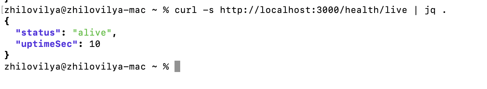

#### Проверка готовности

`GET /health/ready` возвращает 200 `{ "status": "ready" }`.

```bash
curl -i http://localhost:3000/health/ready
```

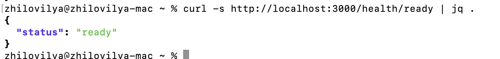

#### Включить режим критической деградации

`POST /admin/degrade` — отвечает `{ "ok": true, "degraded": true }`.

```bash
curl -X POST http://localhost:3000/admin/degrade
```

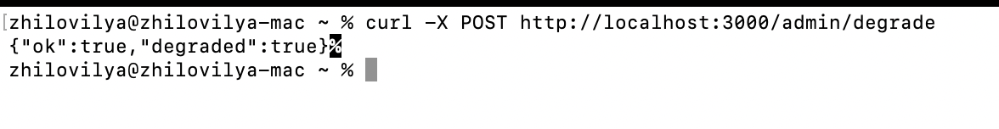

#### Проверка готовности после деградации

`GET /health/ready` теперь возвращает `503 Service Unavailable` с телом `{ "status": "not ready", "reason": "critical degradation" }`. Живость при этом не падает.

```bash
curl -i http://localhost:3000/health/ready
curl -i http://localhost:3000/health/live
```

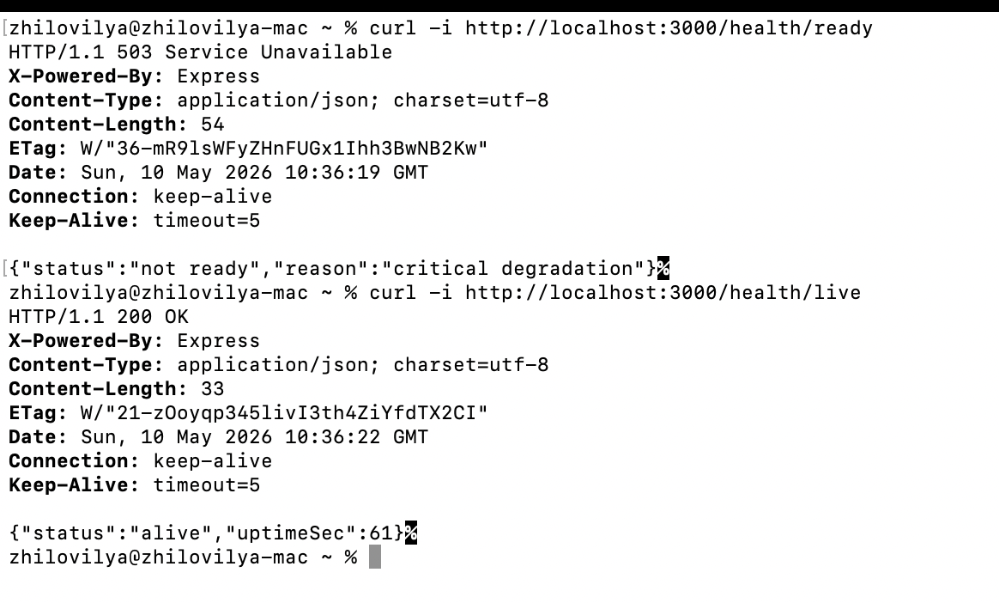

#### Выключить режим деградации

`POST /admin/recover` восстанавливает готовность в `200 ready`.

```bash
curl -X POST http://localhost:3000/admin/recover
curl -i http://localhost:3000/health/ready
```

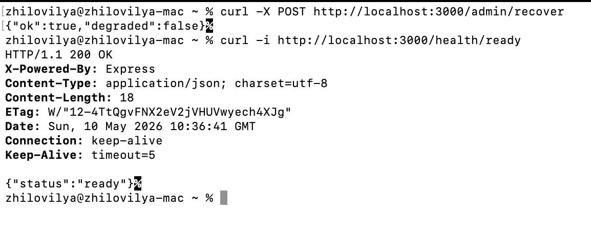

### 7.2. Успешный сценарий бронирования (без сбоев)

Перед сценарием отключаем имитацию сбоя:

```bash
curl -X POST http://localhost:3000/admin/fail/issue/off
```

#### Подать заявку на бронирование

Состояние переходит из `Новый` в `ЗаявкаПринята`.

```bash
curl -X POST http://localhost:3000/process-event \
  -H 'Content-Type: application/json' \
  -d '{"processId":"room-001","event":"ПринятьЗаявку","idempotencyKey":"evt-1","correlationId":"trace-A"}'
```

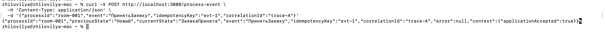

#### Забронировать ресурс

Состояние: `ЗаявкаПринята → РесурсЗабронирован`, в контексте появляется `bookingId`.

```bash
curl -X POST http://localhost:3000/process-event \
  -H 'Content-Type: application/json' \
  -d '{"processId":"room-001","event":"Забронировать","idempotencyKey":"evt-2","correlationId":"trace-A"}'
```

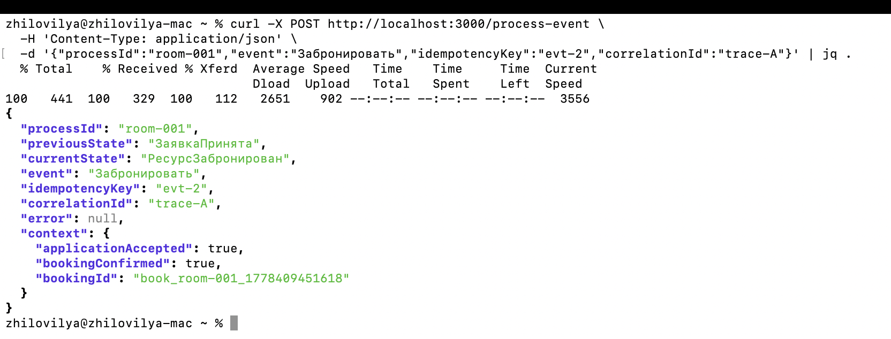

#### Отключить имитацию сбоя на шаге выдачи доступа

`POST /admin/fail/issue/off` — `{ "ok": true, "issueAccessWillFail": false }`.

```bash
curl -X POST http://localhost:3000/admin/fail/issue/off
```

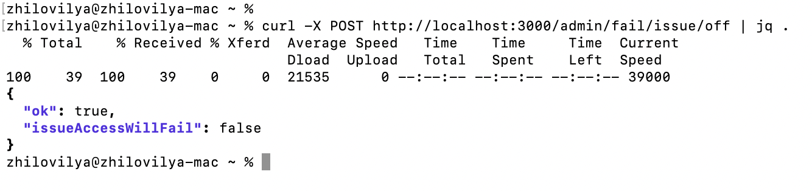

#### Выдать доступ

Состояние: `РесурсЗабронирован → ДоступВыдан`, в контексте появляется `accessCode`.

```bash
curl -X POST http://localhost:3000/process-event \
  -H 'Content-Type: application/json' \
  -d '{"processId":"room-001","event":"ВыдатьДоступ","idempotencyKey":"evt-3","correlationId":"trace-A"}'
```

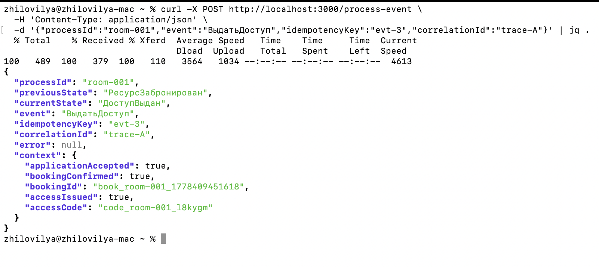

#### Завершить бронирование

Состояние: `ДоступВыдан → Завершён`.

```bash
curl -X POST http://localhost:3000/process-event \
  -H 'Content-Type: application/json' \
  -d '{"processId":"room-001","event":"Завершить","idempotencyKey":"evt-4","correlationId":"trace-A"}'
```

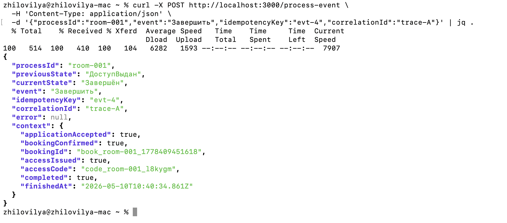

### 7.3. Тестирование идемпотентности

#### Создаём процесс и переводим в состояние ЗаявкаПринята

Состояние — `ЗаявкаПринята`.

```bash
curl -X POST http://localhost:3000/process-event \
  -H 'Content-Type: application/json' \
  -d '{"processId":"room-002","event":"ПринятьЗаявку","idempotencyKey":"idem-1","correlationId":"trace-B"}'
```

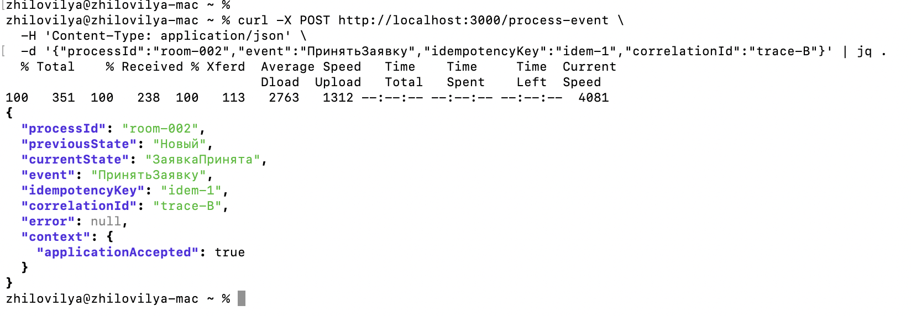

#### Повторный запрос с тем же ключом идемпотентности

Та же команда отправляется второй раз. Ответ содержит `"duplicate": true`, состояние не меняется, счётчик `duplicateEvents` в `/metrics` увеличивается.

```bash
curl -X POST http://localhost:3000/process-event \
  -H 'Content-Type: application/json' \
  -d '{"processId":"room-002","event":"ПринятьЗаявку","idempotencyKey":"idem-1","correlationId":"trace-B"}'
```

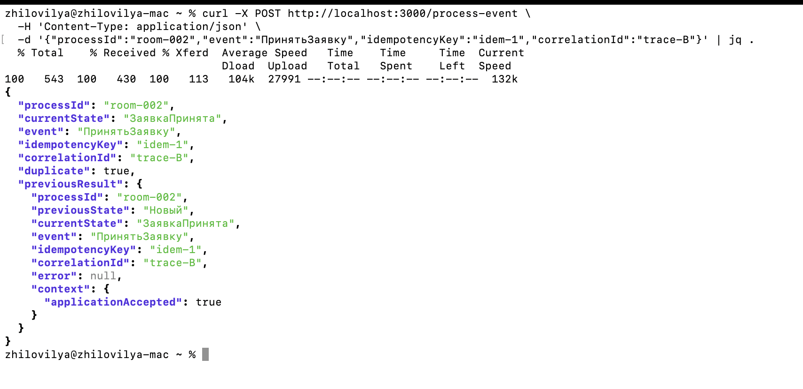

#### Новое событие с новым ключом

Запрос `Забронировать` с `idempotencyKey: "idem-2"` отрабатывает обычным образом — состояние идёт дальше.

```bash
curl -X POST http://localhost:3000/process-event \
  -H 'Content-Type: application/json' \
  -d '{"processId":"room-002","event":"Забронировать","idempotencyKey":"idem-2","correlationId":"trace-B"}'
```

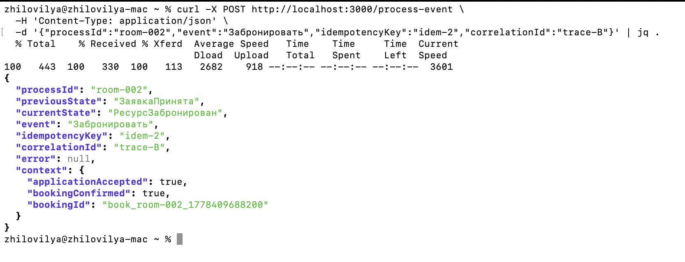

### 7.4. Тестирование сбоя и компенсации

#### Включить имитацию сбоя на шаге выдачи доступа

`POST /admin/fail/issue/on` — `{ "ok": true, "issueAccessWillFail": true }`.

```bash
curl -X POST http://localhost:3000/admin/fail/issue/on
```

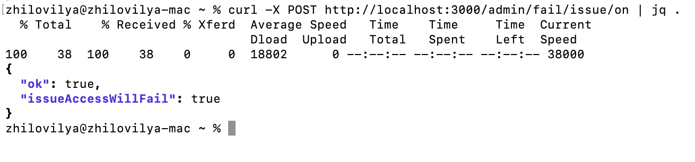

#### Принять заявку

```bash
curl -X POST http://localhost:3000/process-event \
  -H 'Content-Type: application/json' \
  -d '{"processId":"room-003","event":"ПринятьЗаявку","idempotencyKey":"f-1","correlationId":"trace-C"}'
```

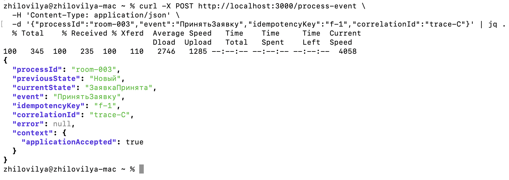

#### Забронировать ресурс

```bash
curl -X POST http://localhost:3000/process-event \
  -H 'Content-Type: application/json' \
  -d '{"processId":"room-003","event":"Забронировать","idempotencyKey":"f-2","correlationId":"trace-C"}'
```

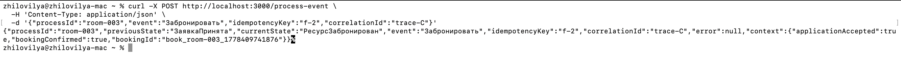

#### Выдать доступ — будет сбой и запустится компенсация

В ответе `currentState` равен `КомпенсацияВыполнена`, в `context.lastError` — `Имитация сбоя на шаге ВыдатьДоступ`. Запись об отмене брони появляется в `/admin/compensation-log`.

```bash
curl -X POST http://localhost:3000/process-event \
  -H 'Content-Type: application/json' \
  -d '{"processId":"room-003","event":"ВыдатьДоступ","idempotencyKey":"f-3","correlationId":"trace-C"}'

curl http://localhost:3000/admin/compensation-log
```

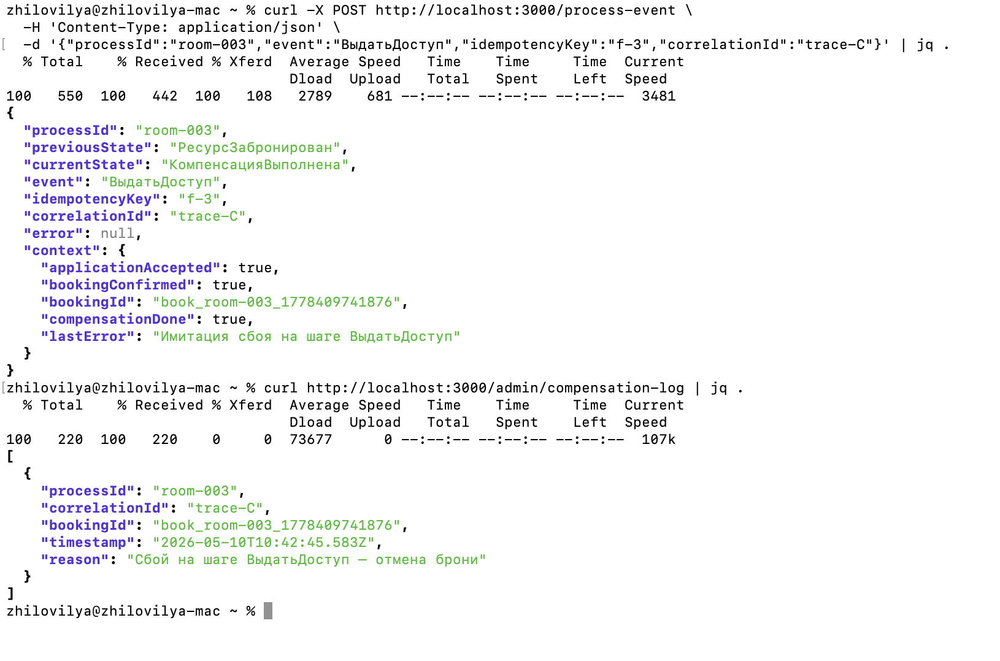

#### Проверка идемпотентности после сбоя

Повторная доставка того же события `ВыдатьДоступ` с `idempotencyKey: "f-3"` возвращает кэшированный ответ с `duplicate: true` — повторная компенсация не выполняется.

```bash
curl -X POST http://localhost:3000/process-event \
  -H 'Content-Type: application/json' \
  -d '{"processId":"room-003","event":"ВыдатьДоступ","idempotencyKey":"f-3","correlationId":"trace-C"}'
```

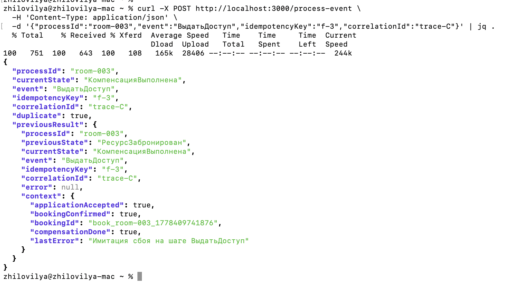

### 7.5. Тестирование невалидных переходов

#### Создать процесс в состоянии Новый

Заводим новый процесс штатным событием — оно отрабатывает успешно (`Новый → ЗаявкаПринята`).

```bash
curl -X POST http://localhost:3000/process-event \
  -H 'Content-Type: application/json' \
  -d '{"processId":"room-004","event":"ПринятьЗаявку","idempotencyKey":"v-1","correlationId":"trace-D"}'
```

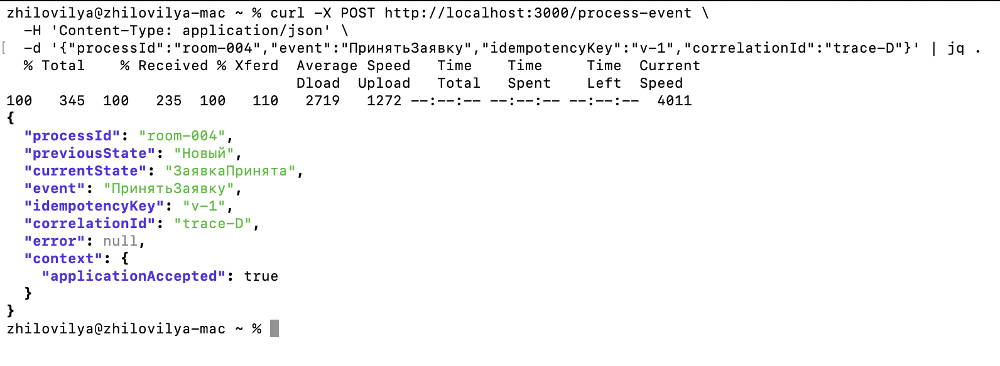

#### Попытка завершить бронирование из состояния Новый

Для свежего процесса `room-005` сразу шлём событие `Завершить`. Ответ — HTTP 422, поле `error` содержит `Недопустимый переход: из состояния "Новый" по событию "Завершить"`. Счётчик `transitionsError` увеличивается.

```bash
curl -i -X POST http://localhost:3000/process-event \
  -H 'Content-Type: application/json' \
  -d '{"processId":"room-005","event":"Завершить","idempotencyKey":"v-2","correlationId":"trace-D2"}'
```

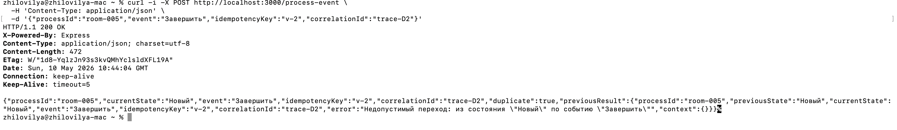

### 7.6. Тестирование параллельных процессов

#### Процесс А: бронирование комнаты А

```bash
curl -X POST http://localhost:3000/process-event \
  -H 'Content-Type: application/json' \
  -d '{"processId":"room-A","event":"ПринятьЗаявку","idempotencyKey":"A-1","correlationId":"trace-A1"}'
```

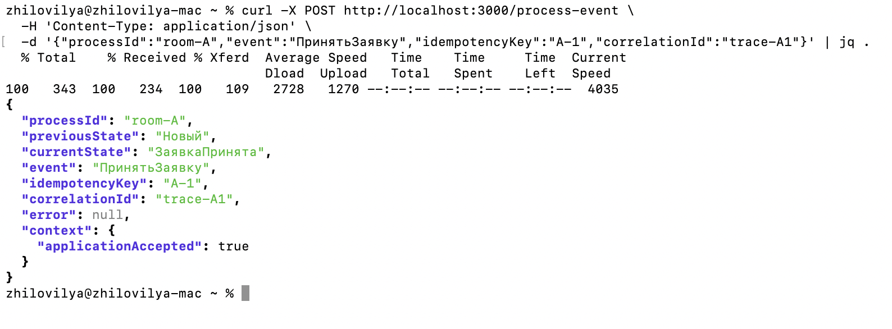

#### Процесс Б: бронирование комнаты Б

Каждый процесс ведёт собственное состояние независимо.

```bash
curl -X POST http://localhost:3000/process-event \
  -H 'Content-Type: application/json' \
  -d '{"processId":"room-B","event":"ПринятьЗаявку","idempotencyKey":"B-1","correlationId":"trace-B1"}'
```

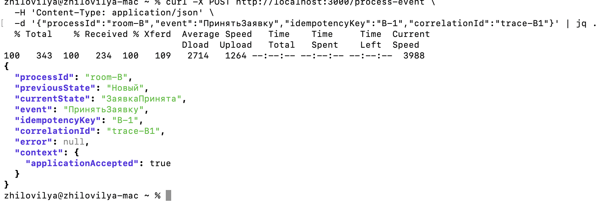

#### Продолжить процесс А — забронировать

`room-A` переходит в `РесурсЗабронирован`, `room-B` остаётся в `ЗаявкаПринята` (последнее можно подтвердить запросом `GET /process-event/room-B`).

```bash
curl -X POST http://localhost:3000/process-event \
  -H 'Content-Type: application/json' \
  -d '{"processId":"room-A","event":"Забронировать","idempotencyKey":"A-2","correlationId":"trace-A2"}'

curl http://localhost:3000/process-event/room-B
```

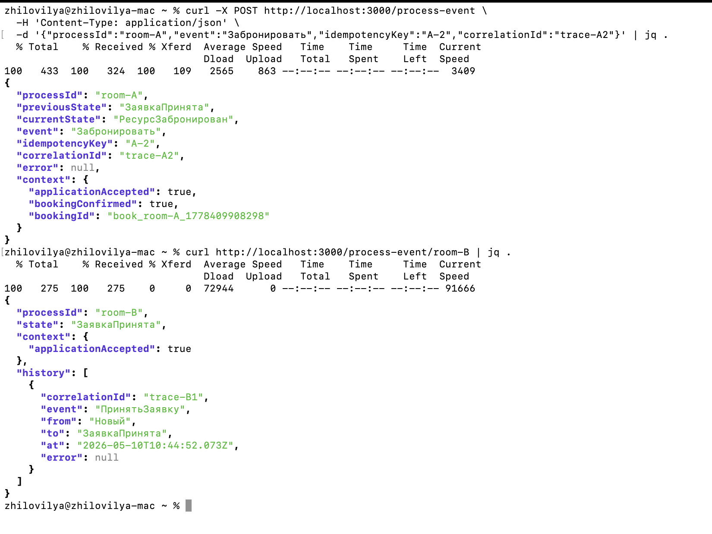

### 7.7. Проверка наблюдаемости

#### Получить все метрики сервиса

`GET /metrics` возвращает счётчики переходов, повторов, компенсаций и оценки задержек шагов.

```bash
curl http://localhost:3000/metrics
```

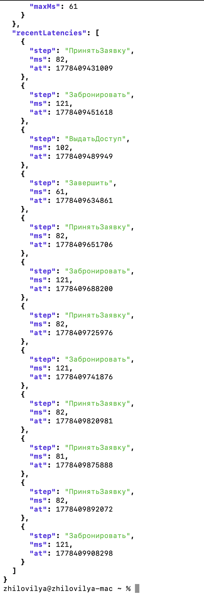
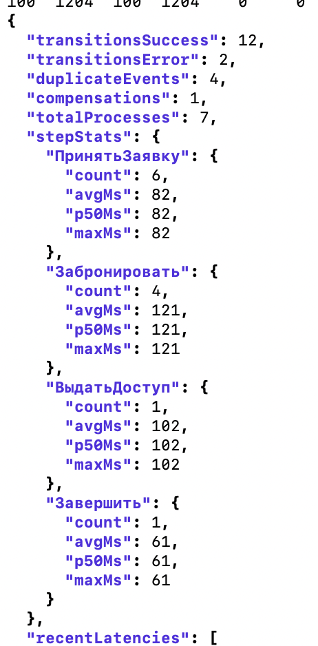

#### Получить журнал компенсаций

`GET /admin/compensation-log` возвращает массив с `processId`, `bookingId`, `correlationId`, временем и причиной отмены.

```bash
curl http://localhost:3000/admin/compensation-log
```
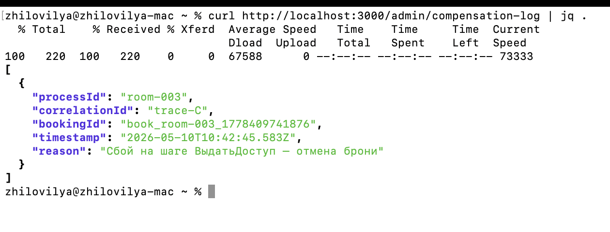

### 7.8. Тестирование ошибок валидации

#### Отсутствуют обязательные поля

Ответ HTTP 400, `{"error":"Не заполнены обязательные поля: processId, event, idempotencyKey, correlationId"}`.

```bash
curl -i -X POST http://localhost:3000/process-event \
  -H 'Content-Type: application/json' \
  -d '{"event":"ПринятьЗаявку"}'
```

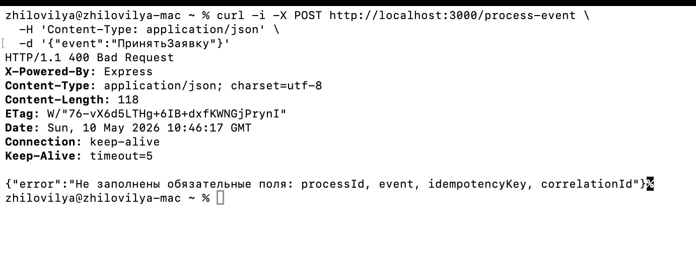

### 7.9. Логи

В консоли сервиса для каждого запроса видны JSON-записи: `process.created`, `transition.attempt`, `step.start`, `step.done`, `transition.success`, `event.duplicate`, `step.failed`, `compensation.start`, `compensation.done`. Все записи связаны единым `correlationId`.

Чтобы получить «насыщенный» лог одним correlationId, удобно подряд выполнить:

```bash
curl -X POST http://localhost:3000/admin/fail/issue/on

curl -X POST http://localhost:3000/process-event \
  -H 'Content-Type: application/json' \
  -d '{"processId":"log-1","event":"ПринятьЗаявку","idempotencyKey":"L-1","correlationId":"log-trace"}'

curl -X POST http://localhost:3000/process-event \
  -H 'Content-Type: application/json' \
  -d '{"processId":"log-1","event":"Забронировать","idempotencyKey":"L-2","correlationId":"log-trace"}'

curl -X POST http://localhost:3000/process-event \
  -H 'Content-Type: application/json' \
  -d '{"processId":"log-1","event":"ВыдатьДоступ","idempotencyKey":"L-3","correlationId":"log-trace"}'
```

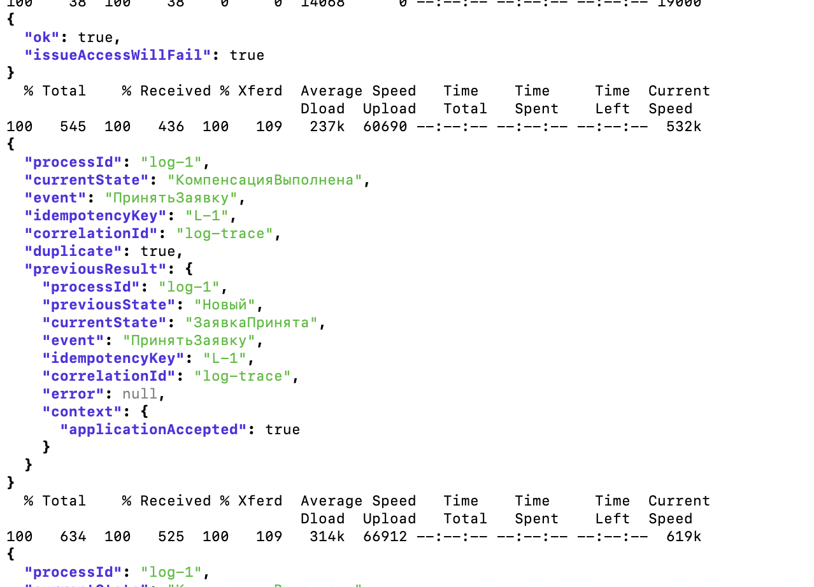
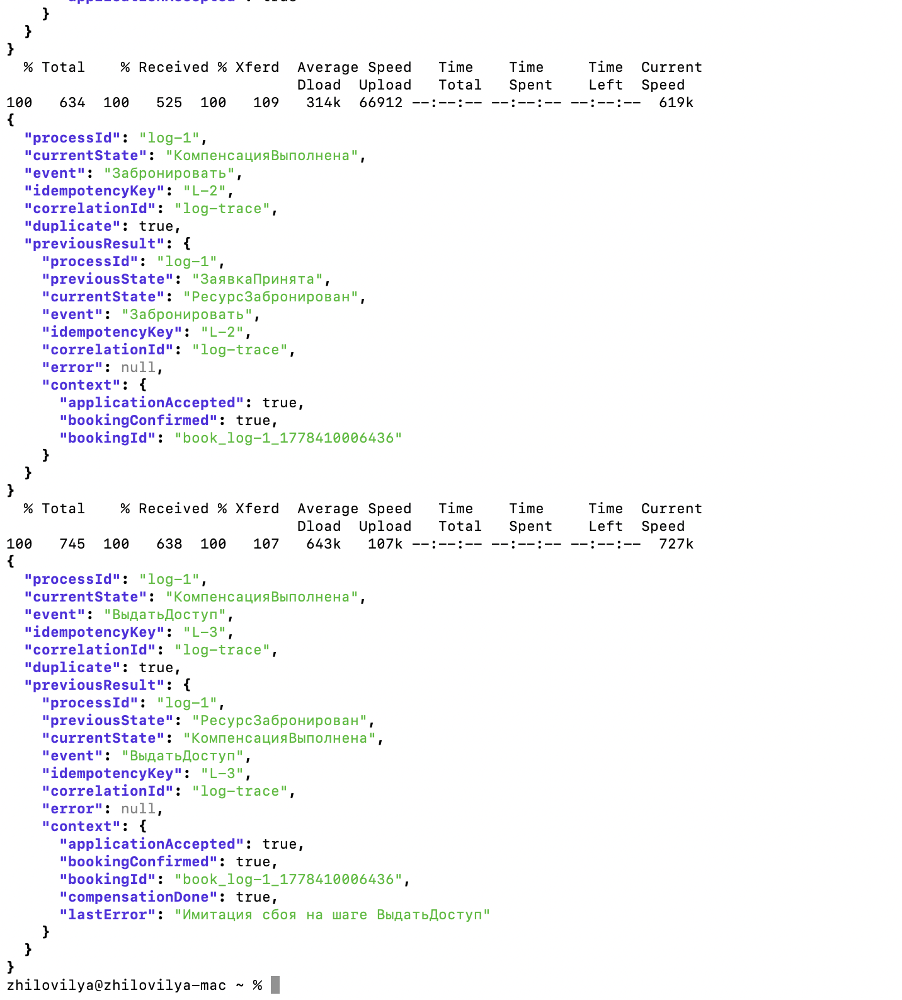

## 8. Выводы

В рамках практической работы №4 разработана веб-служба бронирования переговорных на Node.js + Express. Полностью реализованы все требования задания:

1. Машина состояний из семи состояний с переходами по четырём бизнес-событиям и одним служебным.
2. Хранение состояния в памяти по ключу процесса с накоплением контекста и истории переходов.
3. Идемпотентность по ключу: повторная доставка возвращает кэшированный результат и не меняет состояние.
4. Компенсация при сбое шага `ВыдатьДоступ`: бронь откатывается, процесс уходит в `КомпенсацияВыполнена`.
5. Структурированное JSON-журналирование со сквозным `correlationId` во всех записях.
6. Проверки живости и готовности; готовность падает в 503 при критической деградации.
7. Метрики: успешные/ошибочные переходы, повторные доставки, компенсации и задержки шагов с агрегатами.

Дополнительно реализованы административные ручки для управления флагами имитации сбоев и деградации, маршруты `/admin/processes` и `/admin/compensation-log` для удобного контроля состояния.
